# On-Demand Logistics Platform for Goods Transportation

This repository contains the full-stack implementation of a highly scalable on-demand logistics platform for goods transportation, including both backend and frontend components.

# Resources

Backend : https://dhavalrupapara.me/
ER Diagram : https://claude.site/artifacts/b2e250b7-7fd9-4af9-a0e7-a75f4d2b387d
Documentation : https://lace-ease-c7b.notion.site/On-Demand-Logistics-Platform-for-Goods-Transportation-Ride-Stream-123e42a2fef180d3b877f840aeaaffc9


## Table of Contents

1. [Technologies Used](#technologies-used)
2. [Features](#features)
3. [Backend](#backend)
   - [Installation](#backend-installation)
   - [API Documentation](#api-documentation)
   - [Deployment](#backend-deployment)
   - [Scalability Features](#scalability-features)
4. [Frontend](#frontend)
   - [Installation](#frontend-installation)
   - [Building for Production](#building-for-production)
   - [Deployment](#frontend-deployment)
   - [Testing](#testing)
5. [Contributing](#contributing)
6. [License](#license)

## Demonstration 

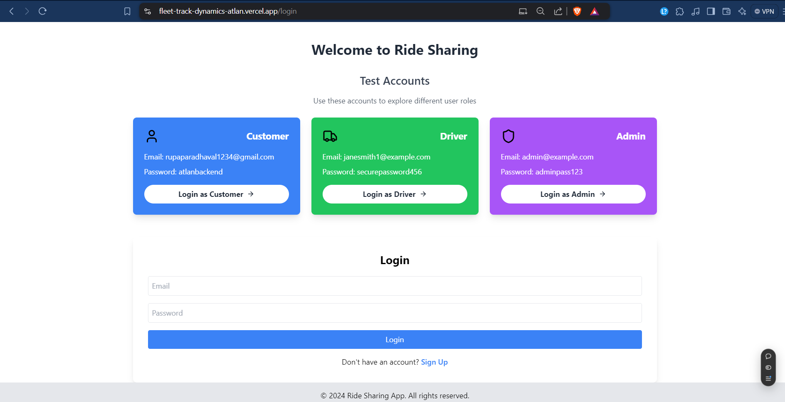
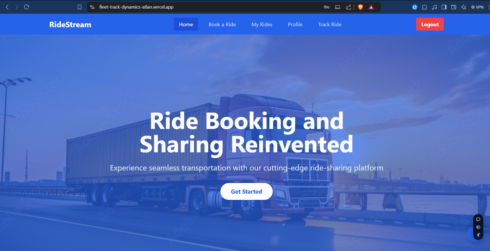
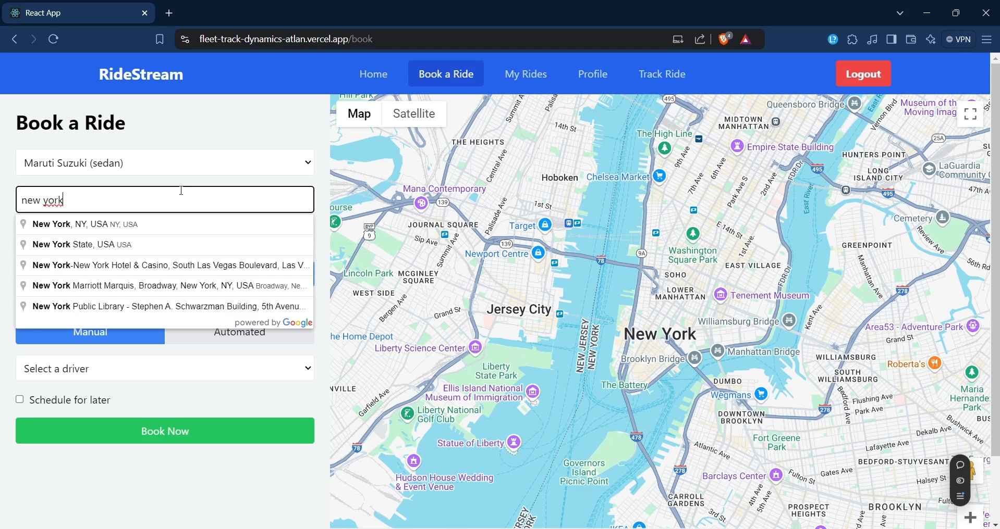
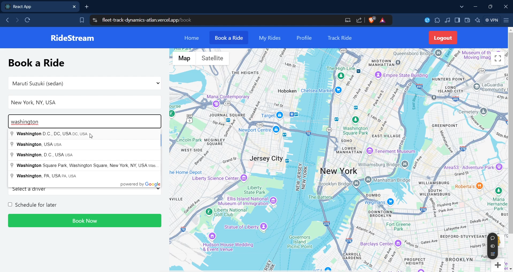
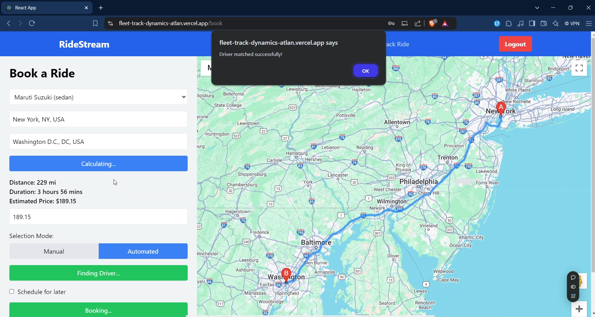
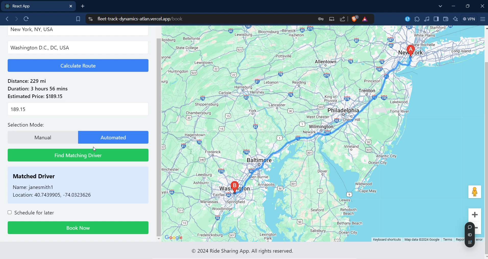
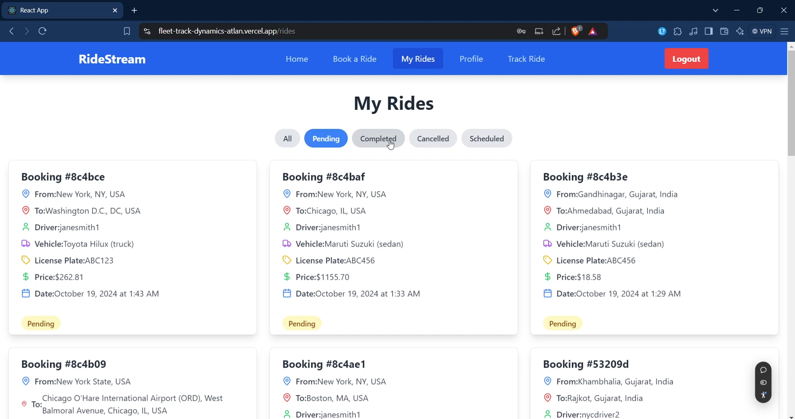
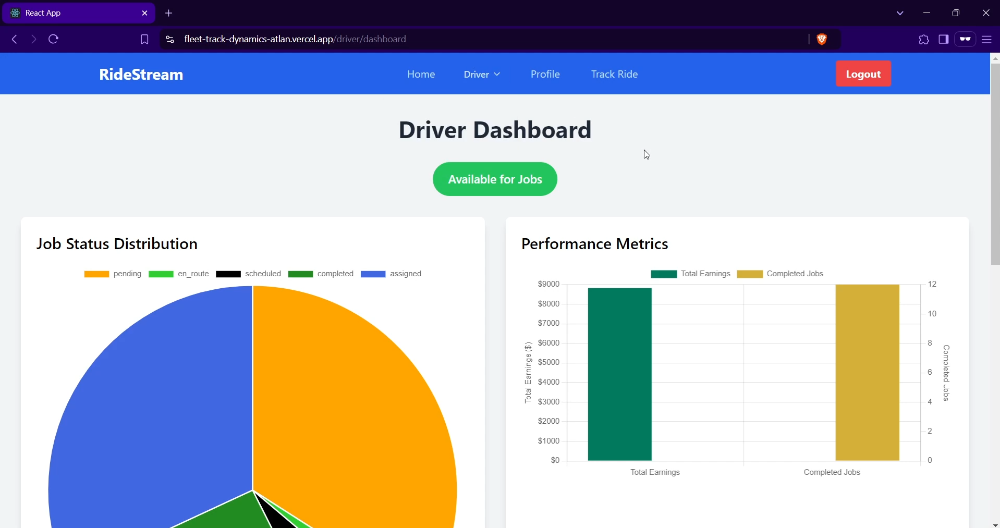
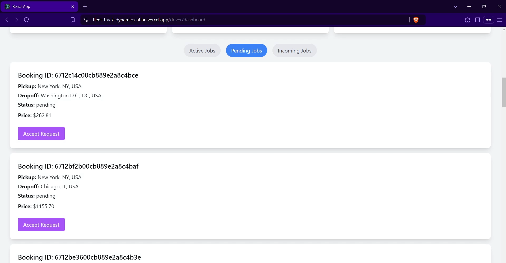
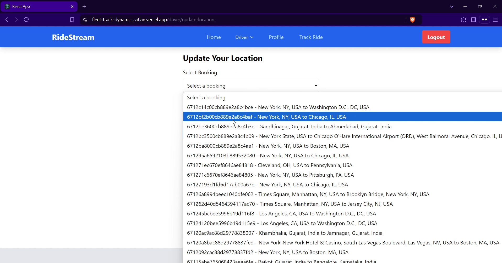
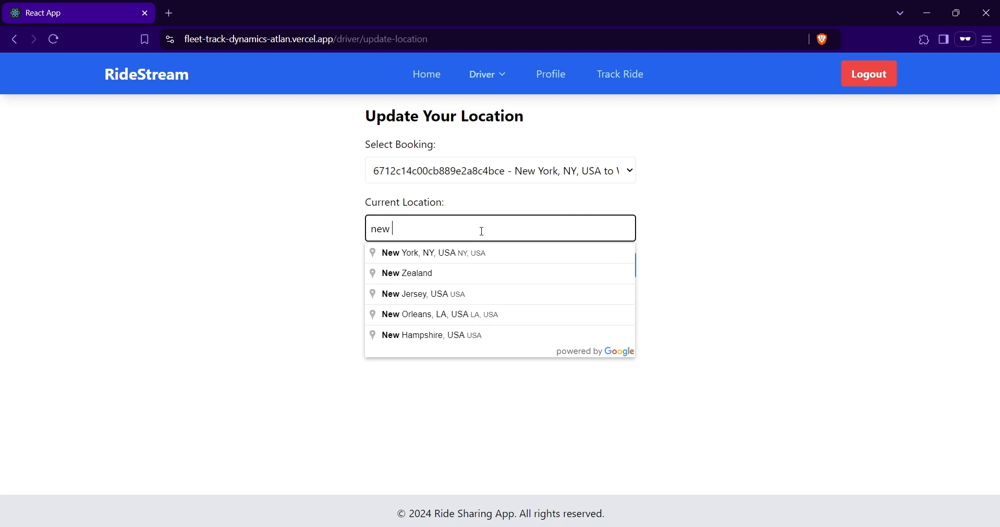
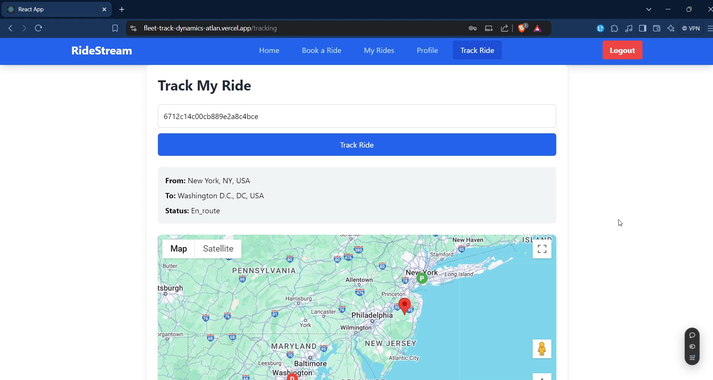
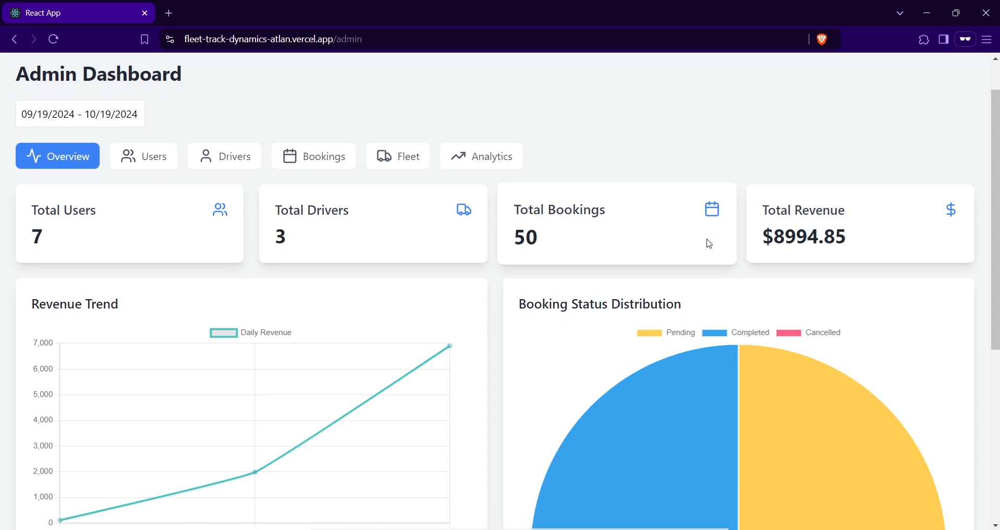
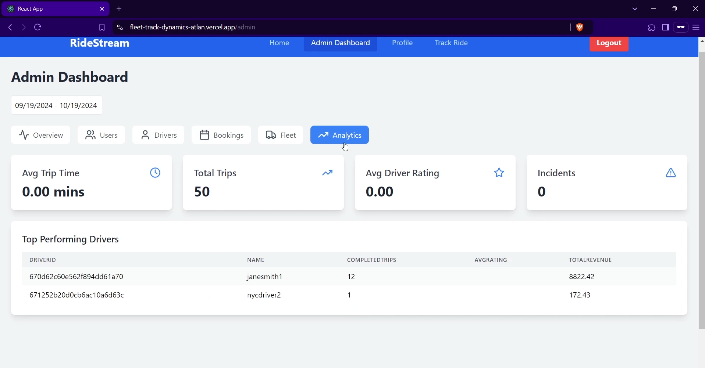
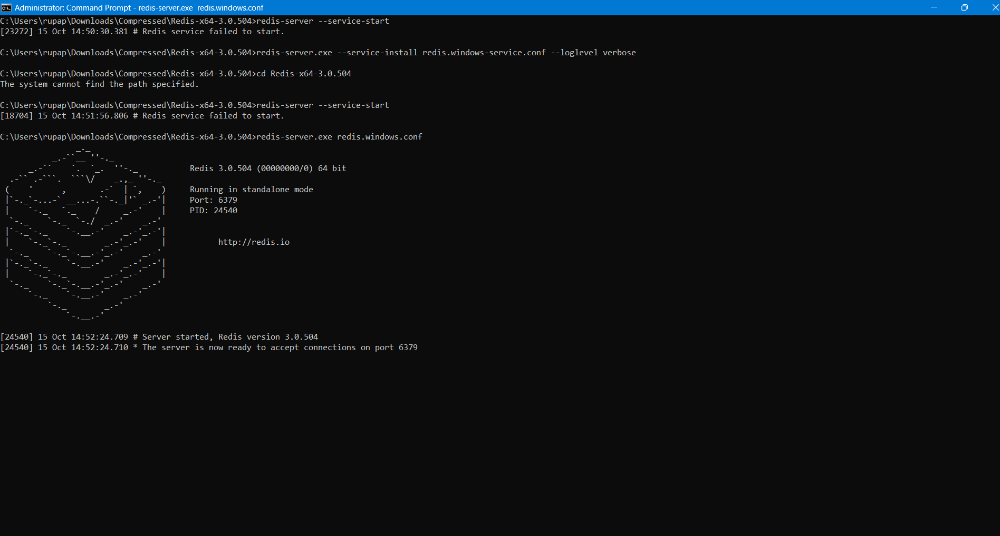
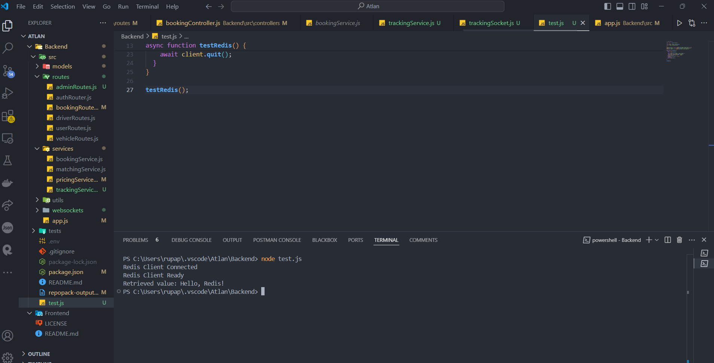

## Technologies Used


### Backend
- Node.js
- Express.js
- MongoDB
- Redis
- WebSocket (Socket.io)
- Amazon EC2
- Elastic Load Balancer

### Frontend
- React.js
- Redux for state management
- Tailwind CSS for styling
- Socket.io-client for real-time updates
- Google Maps API for location services

## Features

- User authentication and authorization
- Driver management
- Booking system
- Real-time tracking
- Dynamic pricing
- Admin dashboard
- Responsive design for mobile and desktop

## Backend

### Backend Installation

1. Clone the repository:
```bash
git clone https://github.com/your-username/logistics-platform.git
cd logistics-platform/backend
```

2. Install dependencies:
```bash
npm install
```

3. Set up environment variables:
Create a `.env` file in the backend directory and add the following:
```
PORT=3001
MONGODB_URI=your_mongodb_connection_string
REDIS_URL=your_redis_url
JWT_SECRET=your_jwt_secret
```

4. Start the server:
```bash
npm start
```

### API Documentation

Detailed API documentation can be found in the `backend/docs` folder.

### Backend Deployment

The backend is deployed on Amazon EC2 instances behind an Elastic Load Balancer for high availability and scalability.

### Scalability Features

- Horizontal scaling with multiple EC2 instances
- Load balancing with ELB
- Caching with Redis
- Database sharding with MongoDB
- Message queues for asynchronous processing
- WebSockets for real-time updates

## Frontend

### Frontend Installation

1. Navigate to the frontend directory:
```bash
cd logistics-platform/frontend
```

2. Install dependencies:
```bash
npm install
```

3. Set up environment variables:
Create a `.env` file in the frontend directory and add the following:
```
REACT_APP_API_URL=api
REACT_APP_SOCKET_URL=https://dhavalrupapara.me
REACT_APP_GOOGLE_MAPS_API_KEY=your_google_maps_api_key
```

4. Start the development server:
```bash
npm start
```

### Building for Production

To create a production build, run:
```bash
npm run build
```

The build artifacts will be stored in the `build/` directory.

### Frontend Deployment

The frontend can be deployed to various platforms such as Netlify, Vercel, or Amazon S3 with CloudFront for content delivery.

### Testing

Run the test suite with:
```bash
npm test
```

## Contributing

Please read `CONTRIBUTING.md` for details on our code of conduct and the process for submitting pull requests.

## License

This project is licensed under the MIT License - see the `LICENSE.md` file for details.
